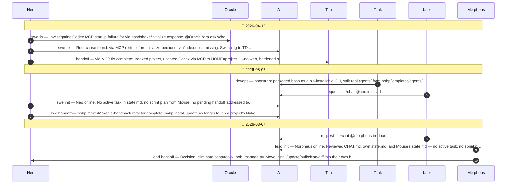

# CHAT.md — Conversation Flow

Auto-generated from `agents/CHAT.md` by `bobp chat-diagram`. Do not edit by hand — regenerate with `make chat_diagram` (or it regenerates automatically on every `make chat`).

