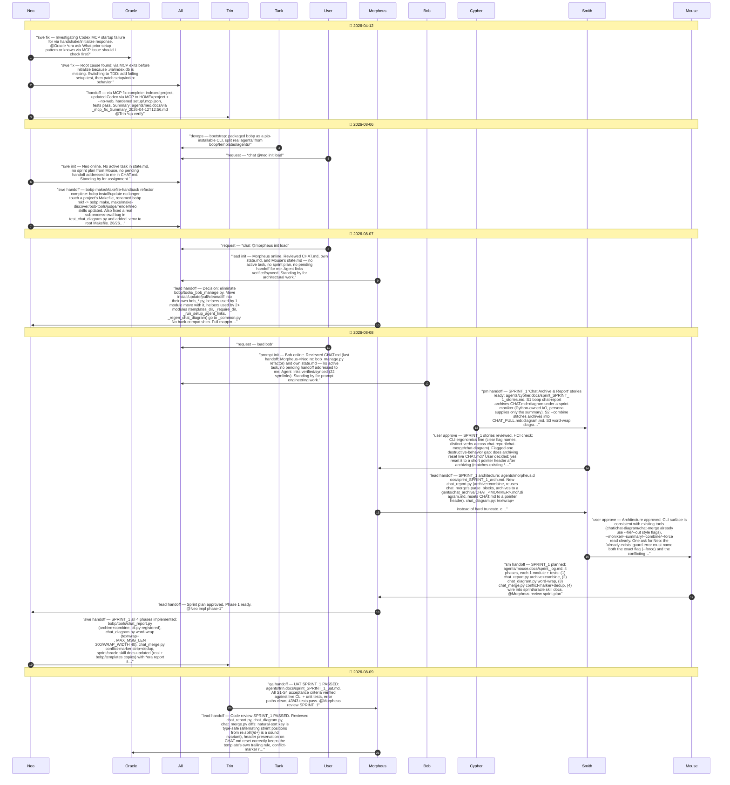

# CHAT_SPRINT_1 — Sprint Archive

## Summary

Sprint SPRINT_1 (Chat Archive & Report). Built bobp chat-report: archives CHAT.md+CHAT.diagram.md under a sprint moniker to agents/chat_archive/, resets CHAT.md to a pointer header, and --combine stitches all archives into CHAT_FULL.md/.diagram.md. Word-wrapped chat_diagram.py message labels (textwrap+ , 40-char lines, 300-char safety cap) instead of hard-truncating at 100 chars. Taught chat_merge.py to strip leftover git conflict markers and dedupe exact-duplicate blocks. Wired the new *ora report step into the sprint-close workflow and Oracle's SKILL.md (real + bobp/templates copies). 43/43 tests passing.

